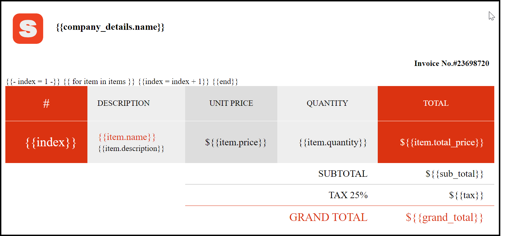
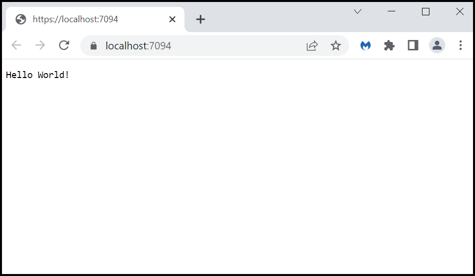
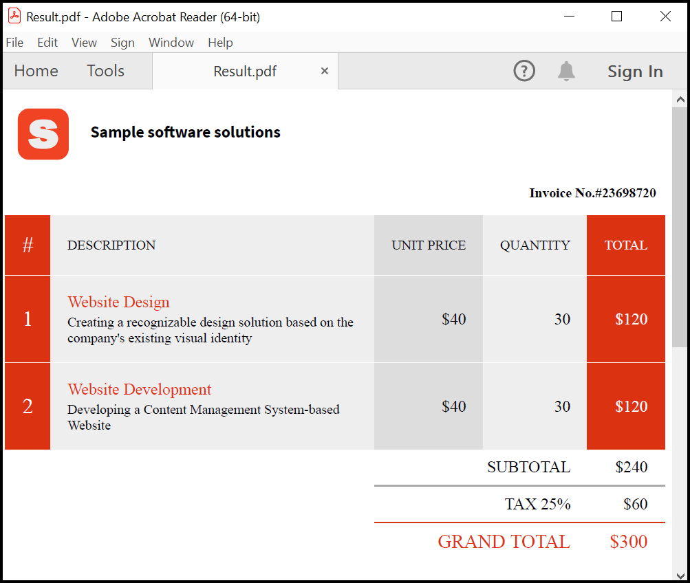
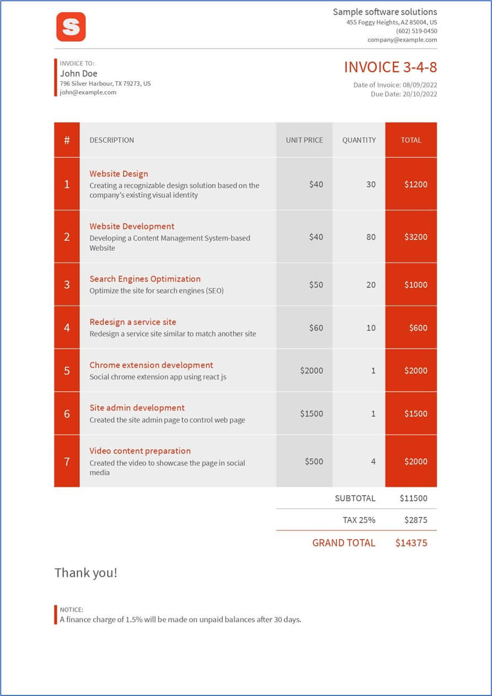
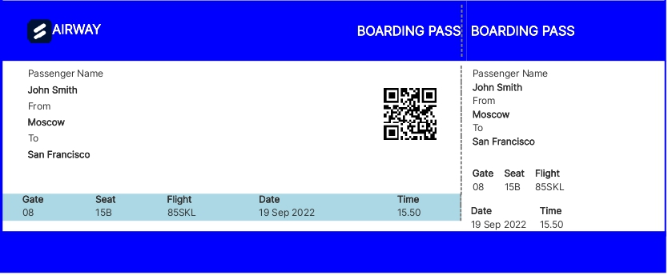
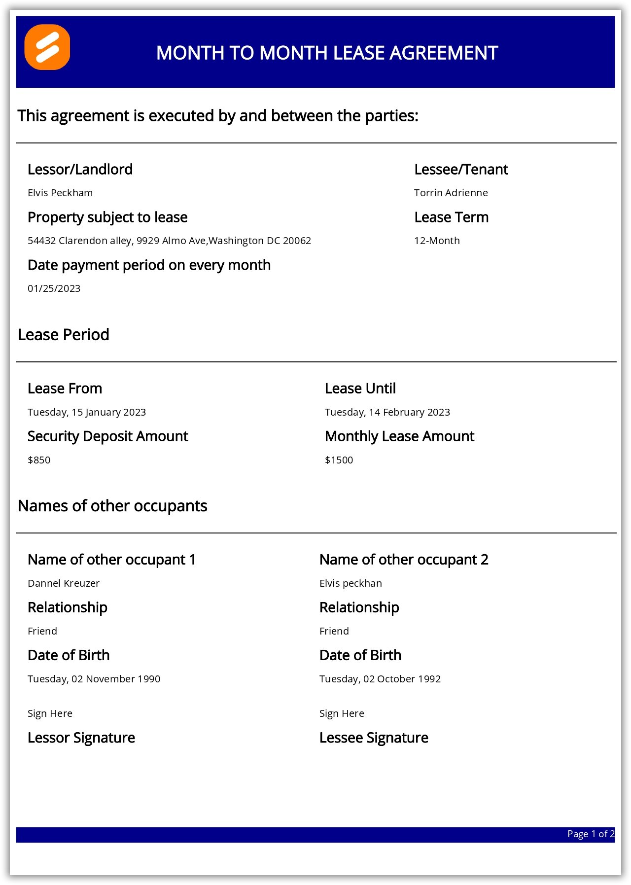
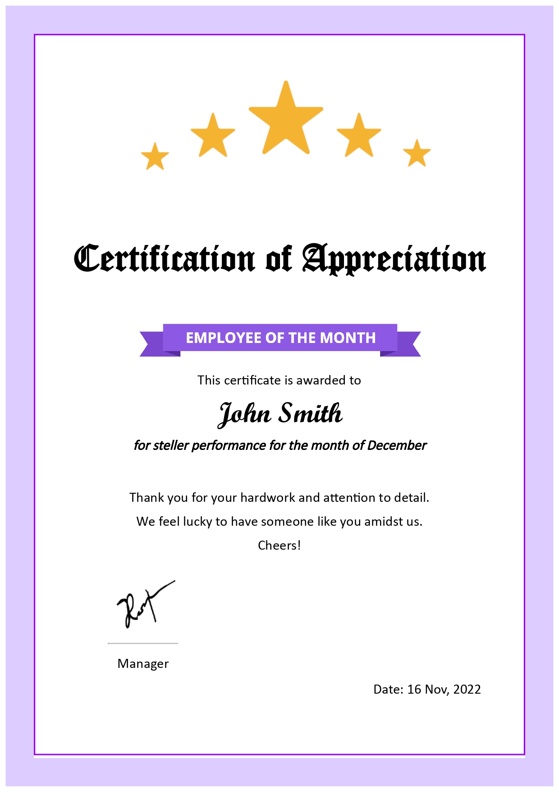
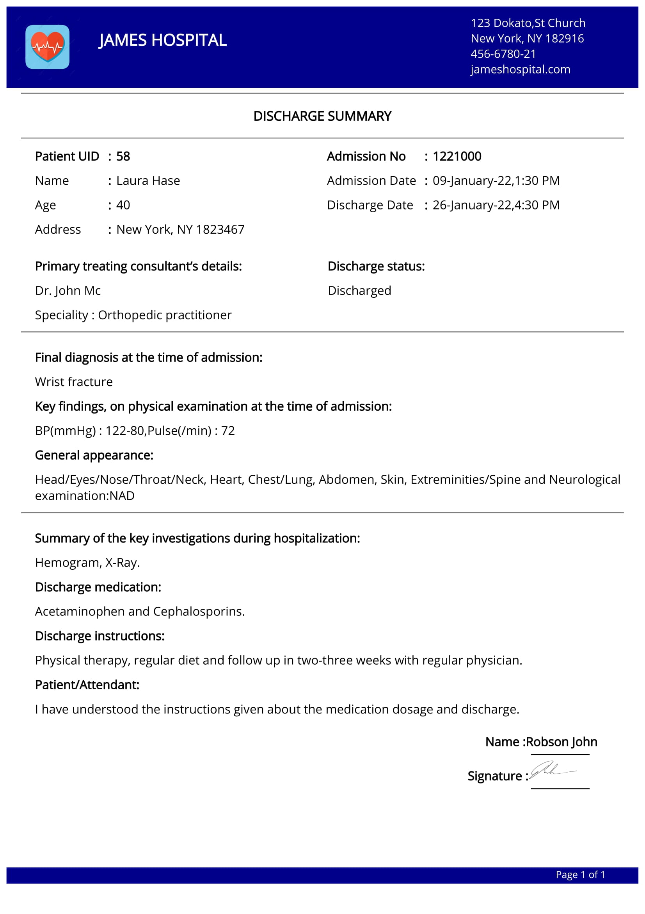
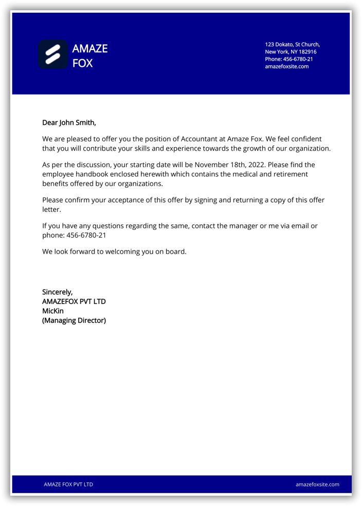
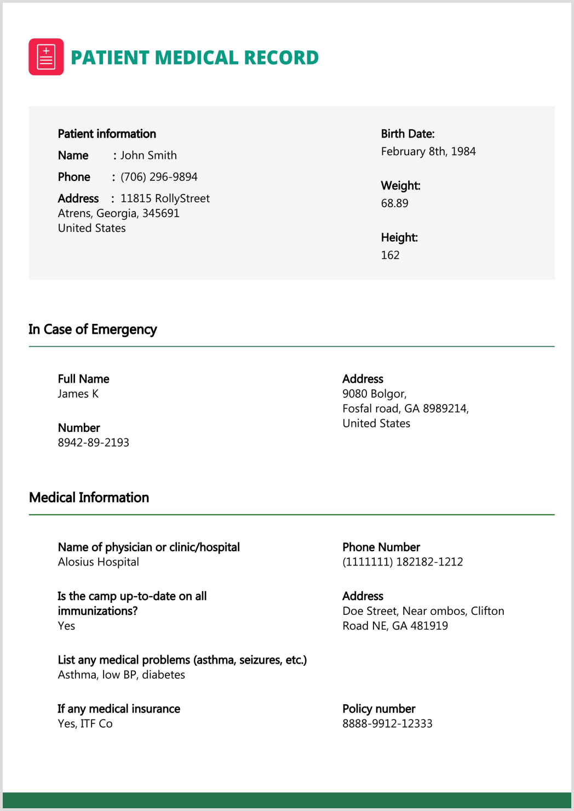

# Generate PDF documents from dynamic HTML using Syncfusion PDF generator API 

This repository explains how to generate PDFs from dynamic HTML using the Syncfusion PDF generator API. Design your document using HTML and CSS, then utilize the Web API to create the PDF."

## Syncfusion PDF generator API 

The Syncfusion PDF generator API enables quick and easy creation of new PDF documents from dynamic HTML files. This Web API supports all HTML structures and customization options.

## Steps to create HTML invoice and conveter to a PDF document using WebAPI
1. Create HTML template 
2. CSS Styling 
3. Utilize Syncfusion Web API Calls 
4. Add HTML File
5. Add Additional Assets (ie., fonts, images, etc)
6. Start the server and invoke the API from Client 

### Create an HTML Template 

An HTML template features {{mustache}} syntax placeholders for data binding. For this illustration, we'll employ the [Scriban scripting language](https://github.com/scriban/scriban) to establish these placeholders. Scriban is a lightweight .NET scripting language and engine. The following HTML template (index.html) displays the invoice number, company information, and supplementary data, incorporating inline CSS for styling. 

**index.html**
```html

<html lang="en">
  <head>
    <meta charset="utf-8">
    <title>Invoice</title>
    <link rel="stylesheet" href="style.css" media="all" />
  </head>
  <body>
      <div class="grid-container">
          <div>
              
          </div>
          <div style="margin-left:30px; margin-top:20px"><b>{{company_details.name}}</b></div>
      </div>
      <div style="text-align:right;margin-right:10px; margin-top:15px"><b>Invoice No.#23698720</b></div>
      <br />
      <main>
          <table border="0" cellspacing="0" cellpadding="0">
              <thead>
                  <tr>
                      <th class="no">#</th>
                      <th class="desc">DESCRIPTION</th>
                      <th class="unit">UNIT PRICE</th>
                      <th class="qty">QUANTITY</th>
                      <th class="total">TOTAL</th>
                  </tr>
              </thead>
              <tbody id="invoiceItems">
                  {{- index = 1 -}}
                  {{ for item in items }}
                  <tr>
                      <td class="no">{{index}}</td>
                      <td class="desc"><h3>{{item.name}}</h3>{{item.description}}</td>
                      <td class="unit">${{item.price}}</td>
                      <td class="qty">{{item.quantity}}</td>
                      <td class="total">${{item.total_price}}</td>
                  </tr>
                  {{index = index + 1}}
                  {{end}}
              </tbody>
              <tfoot>
                  <tr>
                      <td colspan="2"></td>
                      <td colspan="2">SUBTOTAL</td>
                      <td>${{sub_total}}</td>
                  </tr>
                  <tr>
                      <td colspan="2"></td>
                      <td colspan="2">TAX 25%</td>
                      <td>${{tax}}</td>
                  </tr>
                  <tr>
                      <td colspan="2"></td>
                      <td colspan="2">GRAND TOTAL</td>
                      <td>${{grand_total}}</td>
                  </tr>
              </tfoot>
          </table>
      </main>
  </body>
</html>

```

### CSS Styling 

The Cascading Style Sheets (CSS) is a style sheet language used for describing the presentation of a HTML document. In this instance, we have designated the heading as bold, added custom font text, inserted a logo, and styled the table."

**style.css**
```css

@font-face {
  font-family: SourceSansPro;
  src: url(SourceSansPro-Regular.ttf);
}
.grid-container {
    display: grid;
    grid-template-columns: 60px auto;
    padding: 10px;
    font-size: 1.2em;
    font-weight: normal;
    text-align: left;
}
table {
  width: 100%;
  border-collapse: collapse;
  border-spacing: 0;
  margin-bottom: 20px;
}
table th,
table td {
  padding: 20px;
  background: #EEEEEE;
  text-align: center;
  border-bottom: 1px solid #FFFFFF;
}
table th {
  white-space: nowrap;        
  font-weight: normal;
}
table td {
  text-align: right;
}
table td h3{
  color: #db3311;
  font-size: 1.2em;
  font-weight: normal;
  margin: 0 0 0.2em 0;
}
table .no {
  color: #FFFFFF;
  font-size: 1.6em;
  background: #db3311;
}
table .desc {
  text-align: left;
}
table .unit {
  background: #DDDDDD;
}
table .qty {
}
table .total {
  background: #db3311;
  color: #FFFFFF;
}
table td.unit,
table td.qty,
table td.total {
  font-size: 1.2em;
}
table tbody tr:last-child td {
  border: none;
}
table tfoot td {
  padding: 10px 20px;
  background: #FFFFFF;
  border-bottom: none;
  font-size: 1.2em;
  white-space: nowrap; 
  border-top: 1px solid #AAAAAA; 
}
table tfoot tr:first-child td {
  border-top: none; 
}
table tfoot tr:last-child td {
  color: #db3311;
  font-size: 1.4em;
  border-top: 1px solid #db3311; 
}
table tfoot tr td:first-child {
  border: none;
}

``` 

The following screenshot shows the output of the HTML template with styled CSS.


### Utilize Syncfusion Web API Calls 
Minimal APIs are architected to create HTTP APIs with minimal dependencies. They are ideal for microservices and apps that want to include only the minimum files, features, and dependencies in ASP.NET Core. Kindly refer the below link to create the project in Visual Studio 2022. 
[Steps to create minimal API project with ASP.NET Core 7.0](https://learn.microsoft.com/en-us/aspnet/core/tutorials/min-web-api?view=aspnetcore-7.0&tabs=visual-studio)

In this approach, the [StreamReader](https://learn.microsoft.com/en-us/dotnet/api/system.io.streamreader?view=net-7.0) class to convert the provided HTML and JSON files to text based on the client's request. Then, we integrate the HTML text along with the necessary assets to generate the final PDF document.


```csharp

var html = await context.Request.ReadFormAsync();
var value = html.AsQueryable().ToList().Where(x => x.Key == "application/json").FirstOrDefault().Value.ToString();
var options = JsonConvert.DeserializeObject<ConversionOptions>(value);

string htmlText = "";
string jsonData = "";
if (options != null)
{
  htmlText = ReadText(html.Files[options.Index].OpenReadStream());
  jsonData = ReadText(html.Files[options.Data].OpenReadStream());
  CopyAssets(options.Assets, html.Files);
}

String path = Path.GetFullPath("template/");
var conversion = new HtmlToPdfConversion();
var pdf = conversion.ConvertToPDF(htmlText, path, jsonData, options);
context.Response.ContentType = "application/pdf";
await context.Response.Body.WriteAsync(pdf);

```


### Call Web API from C# console application 
The client application in this implementation is a .NET Console application built with .NET version 7. To create a new .NET console application using Visual Studio 2022, please follow the guidance provided in [this](https://learn.microsoft.com/en-us/dotnet/core/tutorials/with-visual-studio?pivots=dotnet-7-0) link. Within the application, we utilize the **RestClient** from the [RestSharp](https://www.nuget.org/packages/RestSharp) NuGet package to set the server IP address.  

```csharp
var client = new RestClient("https://localhost:7094/pdf"); 
```

#### Incorporating HTML files and additional assets
The inclusion of the HTML and CSS files in the **RestRequest** is necessary. Additionally, any supplementary assets such as fonts, images, and PDF size specifications should be sent along with the request, with the **assets** key of the HTML serving as the designated location.

``Assets passed in the request must match the name used to reference in the file.``

```csharp

var request = new RestRequest().AddFile("index.html", "Template/index.html")
 .AddFile("style.css", "Template/style.css").AddFile("data.json", "Template/InvoiceData.json").AddFile("logo.png", "/logo.png").AddFile("SourceSansPro-Regular.ttf", "Template/SourceSansPro-Regular.ttf");
request.Method = Method.Post; 
var json = new JsonObject
{
    ["index"] = "index.html",
    ["data"] = "data.json",
    ["width"] = 595,
    ["height"] = 842,
    ["margin"] = 0,
    ["assets"] = new JsonArray
 {
 "style.css",
 "SourceSansPro-Regular.ttf",
 "logo.png"
 }
}; 
request.AddParameter("application/json", json.ToString(), ParameterType.RequestBody); 
var response = await client.ExecuteAsync(request);
if (response.StatusCode == System.Net.HttpStatusCode.OK)
{
    System.IO.File.WriteAllBytes("Result.pdf", response.RawBytes);
    
}

``` 

### Steps to start the server and invoking the Web API from Client 

Step 1: Download both the server and client application. 

Step 2: Open the solution files of both projects using Visual Studio. 

Step 3: Rebuild the solution to install the required NuGet package. 

Step 4: First run the Web API application (PDF_from_HTML_API), which will lauch the published website in the browser. 


Step 5: Take the localhost path (i.e., https://localhost:7094/pdf) and insert it into the RestClient constructor of the client application. Upon running the client application, this will result in the generation of a PDF document (Result.pdf) within the designated folder (bin/debug/net7.0/).

Upon successful conversion, you will receive a PDF document as illustrated in the following screenshot.  


## Sample Templates 

Template Name | HTML Template | Description 
--- | --- | ---
[Invoice](https://github.com/SowmiyaLoganathan/Generate-PDF-from-HTML/tree/main/Templates/Invoice) |  | An invoice is a commercial document issued by a seller to a buyer relating to a sale transaction and indicating the products, quantities, and agreed-upon prices for products or services the seller had provided the buyer. 
[BoardingPass](https://github.com/SowmiyaLoganathan/Generate-PDF-from-HTML/tree/main/Templates/BoardingPass) |  | A boarding pass is a document provided by an airline during check-in, giving a passenger permission to board the airplane for a particular flight.
[Lease Agreement](https://github.com/SowmiyaLoganathan/Generate-PDF-from-HTML/tree/main/Templates/LeaseAgreement) |  | A rental agreement is a contract of rental, usually written, between the owner of a property and a renter who desires to have temporary possession of the property.
[EmployeeCertificate](https://github.com/SowmiyaLoganathan/Generate-PDF-from-HTML/tree/main/Templates/Certificate) |   | This certificate is one of the way to say thank you to the employees who work in their organization.
[HospitalDischarge](https://github.com/SowmiyaLoganathan/Generate-PDF-from-HTML/tree/main/Templates/HospitalDischarge) |   | This hospital discharge template captures the medical information related to patient during the stay in the hospital.
[JobOfferLetter](https://github.com/SowmiyaLoganathan/Generate-PDF-from-HTML/tree/main/Templates/JobOfferLetter) |  | Job offer letter refers to an official document employer gives to an employee in order to provide them with an offer of employment.
[PatientMedicalRecord](https://github.com/SowmiyaLoganathan/Generate-PDF-from-HTML/tree/main/Templates/PatientMedicalRecord) |  | The patient medical records are used to describe the systematic documentation of a single patient's medical history.

