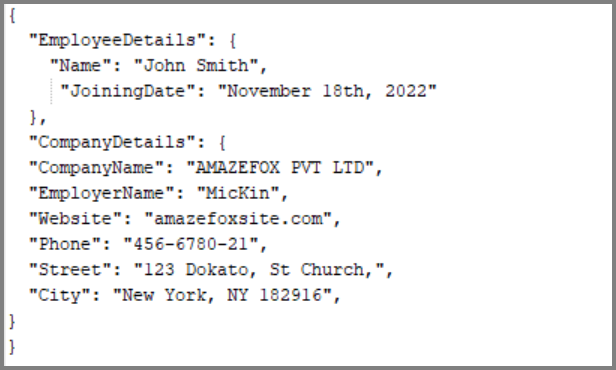

# Generate PDF documents from dynamic HTML using Syncfusion PDF generator API 

The [Syncfusion HTML-to-PDF converter library](https://www.syncfusion.com/document-processing/pdf-framework/net/html-to-pdf) in combination with [ASP.NET Core Minimal Web API](https://learn.microsoft.com/en-us/aspnet/core/tutorials/min-web-api?view=aspnetcore-7.0&tabs=visual-studio) offers a simple and straightforward approach for dynamically generating PDFs from HTML templates. 

In this repository, we will learn how to create an ASP.NET Core Minimal Web API that dynamically generates a PDF document from an HTML template using Syncfusion HTML-to-PDF converter library.  

## Steps to create PDF invoice from HTML template using ASP.NET Core Minimal Web API
1. Create HTML template with CSS styling 
2. Create a minimal Web API project with ASP.NET Core (Server application)  
3. Create Blazor WASM with .NET 7 (Client application)  
4. Launching the Server and Invoking the Web API from the Client  

### Create HTML template with CSS styling 

In HTML file, define the structure of your page, including the head and body sections, any other elements you'd like to include, such as image, header, footer, etc.  

Also, it contains placeholders with {{mustache}} syntax and it is used to bind the actual data to the HTML template. For this example, we'll use the [Scriban scripting language](https://github.com/scriban/scriban) to create the placeholders. It's a lightweight scripting language and engine for .NET. 

N> To learn more about the Scriban scripting language, refer to the [documentation](https://github.com/scriban/scriban/tree/master/doc).

**index.html**
```html

<html lang="en">
  <head>
    <meta charset="utf-8">
    <title>Invoice</title>
    <link rel="stylesheet" href="style.css" media="all" />
  </head>
  <body>
    <header class="clearfix">
      <div id="logo">
        
      </div>
      <div id="company">
        <h2 class="name">{{invoice.company_details.name}}</h2>
        <div>{{invoice.company_details.address}}</div>
        <div>{{invoice.company_details.phone}}</div>
        <div>{{invoice.company_details.email}}</div>
      </div>
      </div>
    </header>
    <main>
      <div id="details" class="clearfix">
        <div id="client">
          <div class="to">INVOICE TO:</div>
          <h2 class="name">{{invoice.customer_details.name}}</h2>
          <div class="address">{{invoice.customer_details.address}}</div>
          <div class="email">{{invoice.customer_details.email}}</div>
        </div>
        <div id="invoice">
          <h1>{{invoice.invoice_number}}</h1>
          <div class="date">Date of Invoice: {{invoice.issue_date}}</div>
          <div class="date">Due Date: {{invoice.due_date}}</div>
        </div>
      </div>
      <table border="0" cellspacing="0" cellpadding="0">
        <thead>
          <tr>
            <th class="no">#</th>
            <th class="desc">DESCRIPTION</th>
            <th class="unit">UNIT PRICE</th>
            <th class="qty">QUANTITY</th>
            <th class="total">TOTAL</th>
          </tr>
        </thead>
        <tbody id="invoiceItems">
		{{- index = 1 -}}
		 {{ for item in invoice.items }}
          <tr>
            <td class="no">{{index}}</td>
            <td class="desc"><h3>{{item.name}}</h3>{{item.description}}</td>
            <td class="unit">${{item.price}}</td>
            <td class="qty">{{item.quantity}}</td>
            <td class="total">${{item.total_price}}</td>
          </tr>
		  {{index = index + 1}}
		  {{end}}
        </tbody>
        <tfoot>
          <tr>
            <td colspan="2"></td>
            <td colspan="2">SUBTOTAL</td>
            <td>${{invoice.sub_total}}</td>
          </tr>
          <tr>
            <td colspan="2"></td>
            <td colspan="2">TAX 25%</td>
            <td>${{invoice.tax}}</td>
          </tr>
          <tr>
            <td colspan="2"></td>
            <td colspan="2">GRAND TOTAL</td>
            <td>${{invoice.grand_total}}</td>
          </tr>
        </tfoot>
      </table>
      <div id="thanks">Thank you!</div>
      <div id="notices">
        <div>NOTICE:</div>
        <div class="notice">A finance charge of 1.5% will be made on unpaid balances after 30 days.</div>
      </div>
    </main>
  </body>
</html>

```

By default, the properties and methods of .NET objects are automatically exposed with lowercase and _ names. This means that a property like CompanyDetails.Name will be exposed as company_details.name and while performing the conversion, the values can be imported from respective JSON file. 



#### CSS Styling

Create CSS file to control the appearance of your HTML template. In this CSS file, you'll define styles for your page elements, such as font sizes, colors, and images.   

You can get this HTML template with CSS and fonts from this [location](Templates/Invoice/).  

**style.css**
```css

@font-face {
  font-family: SourceSansPro;
  src: url(SourceSansPro-Regular.ttf);
}
.grid-container {
    display: grid;
    grid-template-columns: 60px auto;
    padding: 10px;
    font-size: 1.2em;
    font-weight: normal;
    text-align: left;
}
table {
  width: 100%;
  border-collapse: collapse;
  border-spacing: 0;
  margin-bottom: 20px;
}
table th,
table td {
  padding: 20px;
  background: #EEEEEE;
  text-align: center;
  border-bottom: 1px solid #FFFFFF;
}
table th {
  white-space: nowrap;        
  font-weight: normal;
}
table td {
  text-align: right;
}
table td h3{
  color: #db3311;
  font-size: 1.2em;
  font-weight: normal;
  margin: 0 0 0.2em 0;
}
table .no {
  color: #FFFFFF;
  font-size: 1.6em;
  background: #db3311;
}
table .desc {
  text-align: left;
}
table .unit {
  background: #DDDDDD;
}
table .qty {
}
table .total {
  background: #db3311;
  color: #FFFFFF;
}
table td.unit,
table td.qty,
table td.total {
  font-size: 1.2em;
}
table tbody tr:last-child td {
  border: none;
}
table tfoot td {
  padding: 10px 20px;
  background: #FFFFFF;
  border-bottom: none;
  font-size: 1.2em;
  white-space: nowrap; 
  border-top: 1px solid #AAAAAA; 
}
table tfoot tr:first-child td {
  border-top: none; 
}
table tfoot tr:last-child td {
  color: #db3311;
  font-size: 1.4em;
  border-top: 1px solid #db3311; 
}
table tfoot tr td:first-child {
  border: none;
}

``` 

The following screenshot shows the output of the HTML template with styled CSS.


Furthermore, any additional resources such as fonts, images, JSON files, etc. should be located in the same folder as the HTML file. Please refer to the screenshot below for visual reference. 


### Create a minimal Web API project with ASP.NET Core 
Minimal APIs are architected to create HTTP APIs with minimal dependencies. They are ideal for microservices and apps that want to include only the minimum files, features, and dependencies in ASP.NET Core. Kindly refer the below link to create the project in Visual Studio 2022. 
[Steps to create minimal API project with ASP.NET Core 7.0](https://learn.microsoft.com/en-us/aspnet/core/tutorials/min-web-api?view=aspnetcore-7.0&tabs=visual-studio)

Within this Web API application, the [Program.cs](API/PDF_generation_API/PDF_generation_API/Program.cs) file employs the [StreamReader](https://learn.microsoft.com/en-us/dotnet/api/system.io.streamreader?view=net-7.0) class to transform the HTML and JSON files, supplied by the client's request, into textual format. Subsequently, combining the HTML text with the required assets via the CopyAssets() method. 

```csharp

app.MapPost("/api/convertToPDF", async (HttpContext context) =>
{
    try
    {
        var html = await context.Request.ReadFormAsync();
        var value = html.AsQueryable().ToList().Where(x => x.Key == "application/json").FirstOrDefault().Value.ToString();
        var options = JsonConvert.DeserializeObject<ConversionOptions>(value);

        string htmlText = "";
        string jsonData = "";
        if (options != null)
        {
            htmlText = ReadText(html.Files[options.Index].OpenReadStream());
            jsonData = ReadText(html.Files[options.Data].OpenReadStream());
            CopyAssets(options.Assets, html.Files);
        }


        String path = Path.GetFullPath("template/");

        var conversion = new HtmlToPdfConversion();
        var pdf = conversion.ConvertToPDF(htmlText, path, jsonData, options);

        context.Response.ContentType = "application/pdf";
        await context.Response.Body.WriteAsync(pdf);
    }
    catch (Exception exception)
    {

    }
});

app.UseCors("AllowBlazorClient");
app.Run();

void CopyAssets(List<string> assets, IFormFileCollection files)
{
    if (Directory.Exists("template/"))
    {
        System.IO.DirectoryInfo di = new DirectoryInfo("template/");

        foreach (FileInfo file in di.GetFiles())
        {
            file.Delete();
        }
    }
    else
        Directory.CreateDirectory("template/");

    var formFiles = files.ToList();
    foreach (var asset in assets)
    {
        Stream stream = formFiles.FirstOrDefault(x => x.FileName == asset).OpenReadStream();
        if (stream != null)
        {
            var fileStream = new FileStream("template/" + asset, FileMode.Create);
            stream.CopyTo(fileStream);
            fileStream.Close();
            stream.Close();
        }
    }
}
string ReadText(Stream strem)
{
    StreamReader reader = new StreamReader(strem);
    string text = reader.ReadToEnd();
    reader.Close();
    strem.Dispose();

    return text;
}

```

Next, the [HtmlToPdfConverter](https://help.syncfusion.com/cr/file-formats/Syncfusion.HtmlConverter.HtmlToPdfConverter.html) is utilized to turn the HTML string, accompanied by the assets, into a PDF document via the blink rendering engine within the [HtmlToPdfConversion.cs](API/PDF_generation_API/PDF_generation_API/HtmlToPdfConversion.cs) file. During this conversion, we have established the size and margin of the PDF page and the viewport size using the [BlinkConverterSettings](https://help.syncfusion.com/cr/file-formats/Syncfusion.HtmlConverter.BlinkConverterSettings.html) class. Please refer to the accompanying code example for further information.  

```csharp

var expando = JsonConvert.DeserializeObject<ExpandoObject>(modelData);
var sObject = BuildScriptObject(expando);
var templateCtx = new Scriban.TemplateContext();
templateCtx.PushGlobal(sObject);
var template = Scriban.Template.Parse(pageContent);
var result = template.Render(templateCtx);

//Initialize HTML to PDF converter with Blink rendering engine
HtmlToPdfConverter htmlConverter = new HtmlToPdfConverter(HtmlRenderingEngine.Blink);
BlinkConverterSettings blinkConverterSettings = new BlinkConverterSettings();
if (options.Width != 0 && options.Height != 0)
{
    blinkConverterSettings.PdfPageSize = new Syncfusion.Drawing.SizeF(options.Width, options.Height);
}
else
{
    blinkConverterSettings.ViewPortSize= new Syncfusion.Drawing.Size(595, 842);
}
blinkConverterSettings.Margin = new PdfMargins() { All = options.Margin };
htmlConverter.ConverterSettings = blinkConverterSettings;
//Convert HTML string to PDF
PdfDocument document = htmlConverter.Convert(result, path);

//Save and close the PDF document 
MemoryStream output = new MemoryStream();
document.Save(output);
document.Close(true);

```

### Create Blazor WASM application (client)  

The client application in this implementation is a Blazor WASM application built with .NET version 7.0. To create a new ASP.NET Core Blazor WebAssembly application using Visual Studio 2022, please follow the guidance provided in [this](https://help.syncfusion.com/file-formats/pdf/create-pdf-document-in-blazor#steps-to-create-pdf-document-in-blazor-client-side-application) link. Within the application, we utilize the *HttpClient.PostAsync* method to send a POST request to the specified URI as an asynchronous operation.

```csharp

//Send request to server 
var response = await client.PostAsync("https://localhost:7045/api/convertToPDF", content); 

```

#### Incorporating HTML files and additional assets 

The inclusion of the HTML and CSS files in the HttpClient is necessary. Additionally, any supplementary assets such as fonts, images, and PDF size specifications should be sent along with the request using the *MultipartFormDataContent*.  

```csharp

private async Task ConvertToPDF()
{
    //Create http client to send both files and json data
    using (var client = new HttpClient())
    {
            //Create multipart form data content
            using (var content = new MultipartFormDataContent())
            {
                var html = await Http.GetByteArrayAsync("Invoice/index.html");
                var css = await Http.GetByteArrayAsync("Invoice/style.css");
                var data = await Http.GetByteArrayAsync("Invoice/InvoiceData.json");
                var logo = await Http.GetByteArrayAsync("Invoice/logo.png");
                var font = await Http.GetByteArrayAsync("Invoice/SourceSansPro-Regular.ttf");

                //Add file to content
                content.Add(CreateContent("index.html", "index.html", html));
                content.Add(CreateContent("style.css", "style.css", css));
                content.Add(CreateContent("data.json", "data.json", data));
                content.Add(CreateContent("logo.png", "logo.png", logo));
                content.Add(CreateContent("font.ttf", "font.ttf", font));
                var json = new JsonObject
                {
                        ["index"] = "index.html",
                        ["data"] = "data.json",
                        ["width"] = 0,
                        ["height"] = 0,
                        ["margin"] = 40,
                        ["assets"] = new JsonArray
                        {
                          "style.css",
                          "logo.png",
                          "font.ttf"
                        }
                };
                //Add json data to content
                content.Add(new StringContent(json.ToString()), "application/json");
                //Send request to server
                var response = await client.PostAsync("https://localhost:7045/api/convertToPDF", content);
                if (response.StatusCode == HttpStatusCode.OK)
               {
                var responseContent = await response.Content.ReadAsStreamAsync();
                using var Content = new DotNetStreamReference(stream: responseContent);
                await JS.InvokeVoidAsync("SubmitHTML", "HTMLToPDF.pdf", Content);
               }
        }
    }
}

```

Once the requested response status code is OK, then invoke the JavaScript (JS) function in index.html file to save the PDF document.  

```html

<script>
    window.SubmitHTML = async (fileName, contentStreamReference) => {
        const arrayBuffer = await contentStreamReference.arrayBuffer();
        const blob = new Blob([arrayBuffer]);
        const url = URL.createObjectURL(blob);
        const anchorElement = document.createElement('a');
        anchorElement.href = url;
        anchorElement.download = fileName ?? '';
        anchorElement.click();
        anchorElement.remove();
        URL.revokeObjectURL(url);
    }
</script>

```

While building and running the application, the website will open in your default browser. 


### Launching the Server and Invoking the PDF Generation API from the Client 

Here are the steps to launching the server and invoking the PDF generation API from the client application.  

Step 1: Run the Web API application, which will launch the published web API in the browser.   

Step 2: To generate a PDF document using the client application, send an asynchronous POST request to the specified URI (e.g., https://localhost:7094/api/convertToPDF) on the localhost. This will send the request to the server application, which will convert the HTML to PDF and send the response back to the client. After running the client application, click the "Convert to PDF" button, which will initiate the HTML to PDF conversion process and generate a PDF document named "HTMLToPDF.pdf" in the designated folder.  


Upon successful conversion, you will receive a PDF document as illustrated in the following screenshot.  


## Sample Templates 

Template Name | HTML Template | Description 
--- | --- | ---
[Invoice](https://github.com/SyncfusionExamples/generate-pdf-from-html-csharp/tree/master/Templates/Invoice) |  | An invoice is a commercial document issued by a seller to a buyer relating to a sale transaction and indicating the products, quantities, and agreed-upon prices for products or services the seller had provided the buyer. 
[BoardingPass](https://github.com/SyncfusionExamples/generate-pdf-from-html-csharp/tree/master/Templates/BoardingPass) |  | A boarding pass is a document provided by an airline during check-in, giving a passenger permission to board the airplane for a particular flight.
[Lease Agreement](https://github.com/SyncfusionExamples/generate-pdf-from-html-csharp/tree/master/Templates/LeaseAgreement) |  | A rental agreement is a contract of rental, usually written, between the owner of a property and a renter who desires to have temporary possession of the property.
[EmployeeCertificate](https://github.com/SyncfusionExamples/generate-pdf-from-html-csharp/tree/master/Templates/Certificate) |   | This certificate is one of the way to say thank you to the employees who work in their organization.
[HospitalDischarge](https://github.com/SyncfusionExamples/generate-pdf-from-html-csharp/tree/master/Templates/HospitalDischarge) |   | This hospital discharge template captures the medical information related to patient during the stay in the hospital.
[JobOfferLetter](https://github.com/SyncfusionExamples/generate-pdf-from-html-csharp/tree/master/Templates/JobOfferLetter) |  | Job offer letter refers to an official document employer gives to an employee in order to provide them with an offer of employment.
[PatientMedicalRecord](https://github.com/SyncfusionExamples/generate-pdf-from-html-csharp/tree/master/Templates/PatientMedicalRecord) |  | The patient medical records are used to describe the systematic documentation of a single patient's medical history.

# Resources
*   **Product page:** [Syncfusion PDF Framework](https://www.syncfusion.com/document-processing/pdf-framework/net)
*   **Documentation page:** [Syncfusion .NET PDF library](https://help.syncfusion.com/file-formats/pdf/overview)
*   **Online demo:** [Syncfusion .NET PDF library - Online demos](https://ej2.syncfusion.com/aspnetcore/PDF/CompressExistingPDF#/bootstrap5)
*   **Blog:** [Syncfusion .NET PDF library - Blog](https://www.syncfusion.com/blogs/category/pdf)
*   **Knowledge Base:** [Syncfusion .NET PDF library - Knowledge Base](https://www.syncfusion.com/kb/windowsforms/pdf)
*   **EBooks:** [Syncfusion .NET PDF library - EBooks](https://www.syncfusion.com/succinctly-free-ebooks)
*   **FAQ:** [Syncfusion .NET PDF library - FAQ](https://www.syncfusion.com/faq/)

# Support and feedback
*   For any other queries, reach our [Syncfusion support team](https://www.syncfusion.com/support/directtrac/incidents/newincident?utm_source=github&utm_medium=listing&utm_campaign=github-docio-examples) or post the queries through the [community forums](https://www.syncfusion.com/forums?utm_source=github&utm_medium=listing&utm_campaign=github-docio-examples).
*   Request new feature through [Syncfusion feedback portal](https://www.syncfusion.com/feedback?utm_source=github&utm_medium=listing&utm_campaign=github-docio-examples).

# License
This is a commercial product and requires a paid license for possession or use. Syncfusion’s licensed software, including this component, is subject to the terms and conditions of [Syncfusion's EULA](https://www.syncfusion.com/eula/es/?utm_source=github&utm_medium=listing&utm_campaign=github-docio-examples). You can purchase a licnense [here](https://www.syncfusion.com/sales/products?utm_source=github&utm_medium=listing&utm_campaign=github-docio-examples) or start a free 30-day trial [here](https://www.syncfusion.com/account/manage-trials/start-trials?utm_source=github&utm_medium=listing&utm_campaign=github-docio-examples).

# About Syncfusion
Founded in 2001 and headquartered in Research Triangle Park, N.C., Syncfusion has more than 26,000+ customers and more than 1 million users, including large financial institutions, Fortune 500 companies, and global IT consultancies.

Today, we provide 1600+ components and frameworks for web ([Blazor](https://www.syncfusion.com/blazor-components?utm_source=github&utm_medium=listing&utm_campaign=github-docio-examples), [ASP.NET Core](https://www.syncfusion.com/aspnet-core-ui-controls?utm_source=github&utm_medium=listing&utm_campaign=github-docio-examples), [ASP.NET MVC](https://www.syncfusion.com/aspnet-mvc-ui-controls?utm_source=github&utm_medium=listing&utm_campaign=github-docio-examples), [ASP.NET WebForms](https://www.syncfusion.com/jquery/aspnet-webforms-ui-controls?utm_source=github&utm_medium=listing&utm_campaign=github-docio-examples), [JavaScript](https://www.syncfusion.com/javascript-ui-controls?utm_source=github&utm_medium=listing&utm_campaign=github-docio-examples), [Angular](https://www.syncfusion.com/angular-ui-components?utm_source=github&utm_medium=listing&utm_campaign=github-docio-examples), [React](https://www.syncfusion.com/react-ui-components?utm_source=github&utm_medium=listing&utm_campaign=github-docio-examples), [Vue](https://www.syncfusion.com/vue-ui-components?utm_source=github&utm_medium=listing&utm_campaign=github-docio-examples), and [Flutter](https://www.syncfusion.com/flutter-widgets?utm_source=github&utm_medium=listing&utm_campaign=github-docio-examples)), mobile ([Xamarin](https://www.syncfusion.com/xamarin-ui-controls?utm_source=github&utm_medium=listing&utm_campaign=github-docio-examples), [Flutter](https://www.syncfusion.com/flutter-widgets?utm_source=github&utm_medium=listing&utm_campaign=github-docio-examples), [UWP](https://www.syncfusion.com/uwp-ui-controls?utm_source=github&utm_medium=listing&utm_campaign=github-docio-examples), and [JavaScript](https://www.syncfusion.com/javascript-ui-controls?utm_source=github&utm_medium=listing&utm_campaign=github-docio-examples)), and desktop development ([WinForms](https://www.syncfusion.com/winforms-ui-controls?utm_source=github&utm_medium=listing&utm_campaign=github-docio-examples), [WPF](https://www.syncfusion.com/wpf-ui-controls?utm_source=github&utm_medium=listing&utm_campaign=github-docio-examples), [WinUI(Preview)](https://www.syncfusion.com/winui-controls?utm_source=github&utm_medium=listing&utm_campaign=github-docio-examples), [Flutter](https://www.syncfusion.com/flutter-widgets?utm_source=github&utm_medium=listing&utm_campaign=github-docio-examples) and [UWP](https://www.syncfusion.com/uwp-ui-controls?utm_source=github&utm_medium=listing&utm_campaign=github-docio-examples)). We provide ready-to-deploy enterprise software for dashboards, reports, data integration, and big data processing. Many customers have saved millions in licensing fees by deploying our software.

